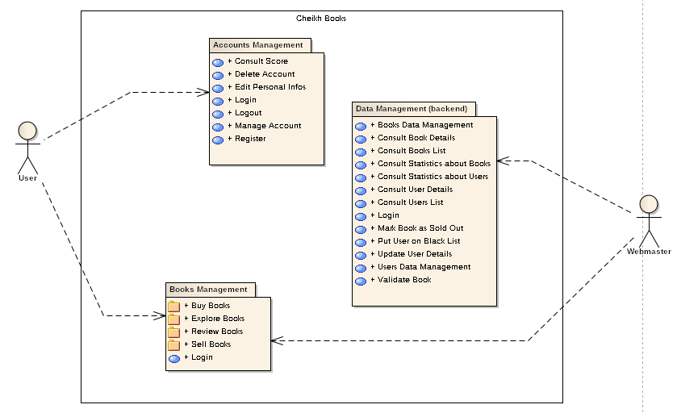
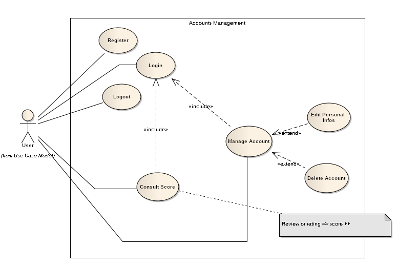
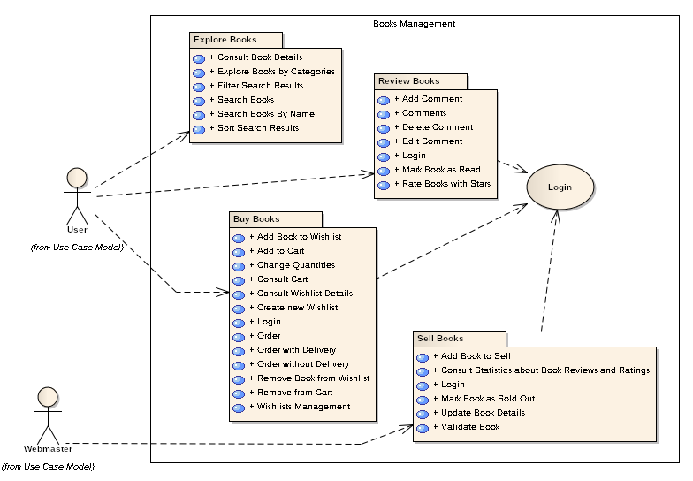
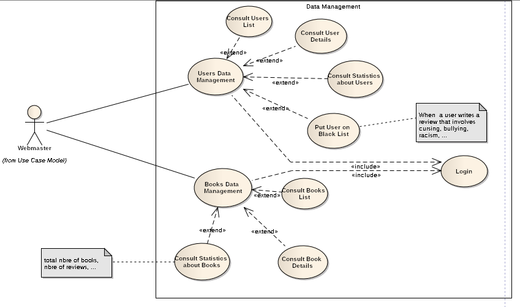
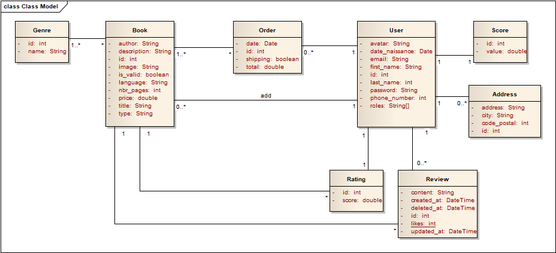

# CheikhBooks.Tn

Book store web application developed using Angular for the frontend and NestJS for the [backend](https://github.com/yosra270/CheikhBooksAPI).

## Development server

Run `ng serve` for a dev server. Navigate to `http://localhost:4200/`. The app will automatically reload if you change any of the source files.

## Features offered by this web application 

 

Users of the application :

* Internet user
* Webmaster

Principal use cases :

* Accounts management
* Books management
* Data management

Each of these global features are described in following diagrams.

* Accounts Management 

 

* Books Management

 

* Data Management

 

## Domain Model

